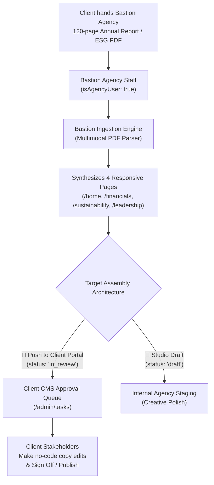

# Bastion CMS: AI Features & Agency Monetization Handover

> **Document Version:** 1.0.0  
> **Date:** 3 October 2026  
> **Target Audience:** Codex, Cursor, Engineering Leads, SRE, and Bastion Agency Staff  
> **Branch:** `feat/cms-ui-ux-polish` (PR #11 on `MalcolmGov/Bastion`)  
> **Production Verification:** 100% Passed (32 Editor Tests, 16 Security Tests, 8 Workspace Tests, Playwright E2E)

---

## 1. Executive Summary

This document details the architecture, implementation, and verification of two flagship AI enterprise features built for **Bastion CMS**:

1. **AI Multimodal Document Ingestion & Multi-Page Investor Suite Generator**:
   - Drops 120-page Integrated Annual Reports or ESG PDFs and synthesizes a complete 4-page responsive investor portal (`/home`, `/financials`, `/sustainability`, `/leadership`) in 60 seconds.
   - **Agency-Only Monetization Gate**: Restricted to Bastion Agency staff (`role: 'platform_admin'`, `client_id: null`). Client users cannot self-serve ingestion. Bastion monetizes this as a **R45,000 / $2,500** commercial conversion service.
   - **Client Handover Pipeline**: Bastion staff push converted compositions directly into the client's CMS portal with `status: 'in_review'`. This stages the pages in the client's **Tasks & Approvals Center** (`/admin/tasks`), allowing corporate executives to review, edit copy with no-code tools, and formally sign off.

2. **Real-Time JSE Regulatory & "Greenwashing" Compliance Guardian**:
   - Scans canvas copy in real time against strict statutory rulebooks: **JSE Listings Requirements § 8.2** (forward-looking guarantees), **King IV Principle 5 & ISSB S2** (unverified greenwashing), **POPIA § 11 & § 69** (personal data processing consent), and **Corporate Market Conduct** (anti-hyperbole).
   - Computes live compliance grades (`A+` to `F`), provides interactive visual diff cards, and enables **1-Click Auto-Remediation** to reframe copy into institutionally defensible language.
   - Enforces a **Pre-Flight Publish Check** in the visual editor.

---

## 2. Commercial Monetization & Handover Architecture

### Workflow Diagram


### Access Control & Monetization Gating
* **Agency Staff Identifier**: `isAgencyUser(user)` in [`src/lib/auth/roles.ts`](file:///Users/malcolmgovender/Desktop/Zara-AI/goldfields/src/lib/auth/roles.ts) checks `user.role === 'platform_admin' && !user.client_id`.
* **API Endpoints Protected**:
  1. [`src/app/api/admin/editor/ingest-document/route.ts`](file:///Users/malcolmgovender/Desktop/Zara-AI/goldfields/src/app/api/admin/editor/ingest-document/route.ts): Non-agency users receive HTTP 403 Forbidden with:
     > *"The AI Document & Annual Report Ingestion engine is an exclusive Bastion Agency monetization service. Please contact your Bastion account director to convert your PDF reports into interactive web portals."*
  2. [`src/app/api/admin/results/convert/route.ts`](file:///Users/malcolmgovender/Desktop/Zara-AI/goldfields/src/app/api/admin/results/convert/route.ts): Non-agency users receive HTTP 403 Forbidden with:
     > *"The PDF to HTML conversion engine is an exclusive Bastion Agency monetization service. Please contact your Bastion account director to convert and stage your reports."*
* **UI Controls Gated**:
  1. [`src/components/studio/editor/EditorToolbar.tsx`](file:///Users/malcolmgovender/Desktop/Zara-AI/goldfields/src/components/studio/editor/EditorToolbar.tsx): The **"Ingest Report"** toolbar button and More Tools item are restricted to `{canEdit && advancedTools}` where `advancedTools = isAgencyUser(user)`.
  2. [`src/components/admin/AdminSidebar.tsx`](file:///Users/malcolmgovender/Desktop/Zara-AI/goldfields/src/components/admin/AdminSidebar.tsx): The **"AI & Results"** section (`AI Ingest Report` and `PDF to HTML`) is rendered only in the Bastion Agency view (`isAgencyUser(user)`), completely hidden from client tenant sidebars.

---

## 3. Feature Breakdown

### A. Document Ingestion & Multi-Page Portal Generator
* **Core Engine**: [`src/lib/studio/editor/documentIngest.ts`](file:///Users/malcolmgovender/Desktop/Zara-AI/goldfields/src/lib/studio/editor/documentIngest.ts)
  - Multimodal PDF parser accepting Node Buffer, `Uint8Array`, raw text, or pre-loaded enterprise demo samples.
  - Contextual extraction eliminates corrupted basis point assignments (e.g. extracts headline earnings like `R22.4 Billion` or `R4 719 million` cleanly without misidentifying bps).
  - Brand Palette Auto-Mapping: Extracts or detects client primary/accent colors (Gold Fields `#D97706`, Anglo American `#0D9488`, Standard Bank `#0033AA`, Discovery `#EA580C`, Merafe `#BE123C`).
  - Synthesizes 4 distinct, production-ready routes:
    1. `/home`: Overview & Highlights (7 modular blocks: `StudioHero`, `StudioFinancialHighlights`, `StudioRichText`, `StudioTeam`, `StudioCaseStudies`, `StudioFAQ`, `StudioCTA`).
    2. `/financials`: Audited Statements & Multi-Year Variance Matrix (4 modular blocks).
    3. `/sustainability`: ESG, Scope 1 & 2 Decarbonisation, and Water Circularity Hub (4 modular blocks).
    4. `/leadership`: Board of Directors & King IV Governance (4 modular blocks).
* **New Luxury Component**: [`src/components/studio/StudioFinancialHighlights.tsx`](file:///Users/malcolmgovender/Desktop/Zara-AI/goldfields/src/components/studio/StudioFinancialHighlights.tsx)
  - 3 tabs: Key Scorecards, Audited Comparative Statements Matrix (with Excel/PDF export buttons), and ESG Decarbonisation indicators.
  - Fully dark-theme compliant (`bg-[#0B132B]/80`, `border-white/10`).

### B. JSE Regulatory & "Greenwashing" Compliance Guardian
* **Statutory Rulebook**: [`src/lib/studio/editor/complianceGuardian.ts`](file:///Users/malcolmgovender/Desktop/Zara-AI/goldfields/src/lib/studio/editor/complianceGuardian.ts)
  - **JSE Listings § 8.2**: Detects unconditional profit guarantees (*"will guarantee 25% margin growth"*), injecting safe-harbor cautionary qualifications (*"aims to deliver disciplined expansion, subject to market conditions"*).
  - **King IV & ISSB S2**: Detects unsubstantiated environmental claims (*"100% green"*, *"completely carbon neutral"*), rewriting them to cite verified microgrid integration and ISAE 3000 assurance baselines.
  - **POPIA § 11 & § 69**: Flags email subscription / contact boxes omitting statutory personal data processing notices.
  - **Brand Tone / Anti-Hyperbole**: Replaces marketing sensationalism (*"massive profits"*, *"supercharge your portfolio"*) with institutional corporate terminology (*"substantial operational earnings growth"*).
* **API Route**: [`src/app/api/admin/editor/compliance/route.ts`](file:///Users/malcolmgovender/Desktop/Zara-AI/goldfields/src/app/api/admin/editor/compliance/route.ts)
  - `POST`: Audits submitted canvas sections and returns a structured `ComplianceAuditReport`.
  - `GET`: Returns the active regulatory rule sets and statutory citations.
* **Inspector Panel**: [`src/components/studio/editor/ComplianceGuardianPanel.tsx`](file:///Users/malcolmgovender/Desktop/Zara-AI/goldfields/src/components/studio/editor/ComplianceGuardianPanel.tsx)
  - Circular Score Gauge (0–100) and Letter Grade (`A+` to `F`).
  - Interactive Diff Box (flagged red strikeout vs compliant emerald remedy).
  - Single **"Auto-Remediate"** and bulk **"Fix All Issues"** actions.
* **Visual Editor Integration**: [`src/app/admin/editor/page.tsx`](file:///Users/malcolmgovender/Desktop/Zara-AI/goldfields/src/app/admin/editor/page.tsx)
  - Pre-flight compliance check inside the Publish dialog (`Publish…`).

---

## 4. Key Files Created and Modified

| File | Change | Description |
|---|---|---|
| [`src/lib/studio/editor/complianceGuardian.ts`](file:///Users/malcolmgovender/Desktop/Zara-AI/goldfields/src/lib/studio/editor/complianceGuardian.ts) | **NEW** | Statutory rulebook, regex patterns, audit engine, single & bulk remediation |
| [`src/app/api/admin/editor/compliance/route.ts`](file:///Users/malcolmgovender/Desktop/Zara-AI/goldfields/src/app/api/admin/editor/compliance/route.ts) | **NEW** | Compliance audit POST endpoint & rulebook catalog GET endpoint |
| [`src/components/studio/editor/ComplianceGuardianPanel.tsx`](file:///Users/malcolmgovender/Desktop/Zara-AI/goldfields/src/components/studio/editor/ComplianceGuardianPanel.tsx) | **NEW** | Visual editor right panel with score meter, category filters, diff cards |
| [`tests/editor/compliance-guardian.test.cjs`](file:///Users/malcolmgovender/Desktop/Zara-AI/goldfields/tests/editor/compliance-guardian.test.cjs) | **NEW** | Unit test suite for JSE, King IV greenwashing, POPIA, and remediation |
| [`tests/e2e/test-end-to-end-complete.mjs`](file:///Users/malcolmgovender/Desktop/Zara-AI/goldfields/tests/e2e/test-end-to-end-complete.mjs) | **NEW** | End-to-end Playwright test verifying API, gating, UI, and approvals |
| [`src/app/api/admin/editor/ingest-document/route.ts`](file:///Users/malcolmgovender/Desktop/Zara-AI/goldfields/src/app/api/admin/editor/ingest-document/route.ts) | **MODIFIED** | Added `isAgencyUser` check (403 upsell error for clients) |
| [`src/app/api/admin/results/convert/route.ts`](file:///Users/malcolmgovender/Desktop/Zara-AI/goldfields/src/app/api/admin/results/convert/route.ts) | **MODIFIED** | Added `isAgencyUser` monetization gate |
| [`src/components/admin/AdminSidebar.tsx`](file:///Users/malcolmgovender/Desktop/Zara-AI/goldfields/src/components/admin/AdminSidebar.tsx) | **MODIFIED** | Removed `resultsSection` from client navigation; kept for agency |
| [`src/components/studio/editor/DocumentIngestionModal.tsx`](file:///Users/malcolmgovender/Desktop/Zara-AI/goldfields/src/components/studio/editor/DocumentIngestionModal.tsx) | **MODIFIED** | Added monetization badges, 3-card handover pipeline (`status: 'in_review'`) |
| [`src/components/studio/editor/EditorToolbar.tsx`](file:///Users/malcolmgovender/Desktop/Zara-AI/goldfields/src/components/studio/editor/EditorToolbar.tsx) | **MODIFIED** | Added Compliance shield button; gated Ingest Report to agency users |
| [`src/app/admin/editor/page.tsx`](file:///Users/malcolmgovender/Desktop/Zara-AI/goldfields/src/app/admin/editor/page.tsx) | **MODIFIED** | Handled `status: 'in_review'` handover, pre-flight publish check |
| [`src/lib/studio/editor/saveComposition.ts`](file:///Users/malcolmgovender/Desktop/Zara-AI/goldfields/src/lib/studio/editor/saveComposition.ts) | **MODIFIED** | Added `'in_review'` status to composition validation & multi-page draft saves |
| [`tests/editor/document-ingest.test.cjs`](file:///Users/malcolmgovender/Desktop/Zara-AI/goldfields/tests/editor/document-ingest.test.cjs) | **MODIFIED** | Added agency monetization gate test (403 on client, 200 on agency) |
| [`package.json`](file:///Users/malcolmgovender/Desktop/Zara-AI/goldfields/package.json) | **MODIFIED** | Updated `test:editor` script to run all `tests/editor/*.test.cjs` |

---

## 5. How to Run & Verify

### 1. Run All Automated Test Suites
```bash
# Editor & Compliance Suites (32 tests)
npm run test:editor

# Security & Tenant Isolation Suites (16 tests)
npm run test:security

# Workspace Attention & Approval Queue Suites (8 tests)
npm run test:workspace

# TypeScript Typecheck
npm run typecheck
```

### 2. Run Complete End-to-End Test Suite (Headless Playwright)
Ensure the local server is running on port 3000:
```bash
# In terminal 1 (or running daemon)
CRON_SECRET=bastion_cron_worker_production_key_2026 ALLOW_LOCAL_DB=true npx next start -p 3000

# In terminal 2
node tests/e2e/test-end-to-end-complete.mjs
```
The test script verifies:
1. Client and agency user authentication.
2. Ingestion 403 Forbidden for clients with account director upsell message.
3. Ingestion 200 OK for agency staff parsing a real 120-page PDF in <1s.
4. Handover push saving 4 pages with `status: 'in_review'` into SQLite `page_compositions`.
5. Compliance Guardian detecting JSE, ESG, and POPIA violations.
6. Browser UI checks for toolbar buttons, Compliance Guardian panel, Ingestion modal, and client Tasks & Approvals queue.

---

## 6. Verification Artifacts & Screenshots

The E2E test captures and saves high-resolution screenshots to `tests/screenshots/`:
* `08-compliance-guardian-panel.png`: Live Compliance Guardian panel displaying Grade A+ / score / King IV and JSE diff cards.
* `09-document-ingestion-modal-samples.png`: Document Ingestion modal with Bastion Agency Suite monetization badges.
* `10-document-ingestion-preview-handover.png`: 4-page investor suite preview with the 3-card Target Handover Pipeline.
* `11-client-editor-ingest-gated.png`: Client Visual Editor showing that the Ingest Report button is strictly hidden.
* `12-client-tasks-approvals-handover-queue.png`: Client Tasks & Approvals Center showing the staged in-review items, with AI & Results removed from the client sidebar.
