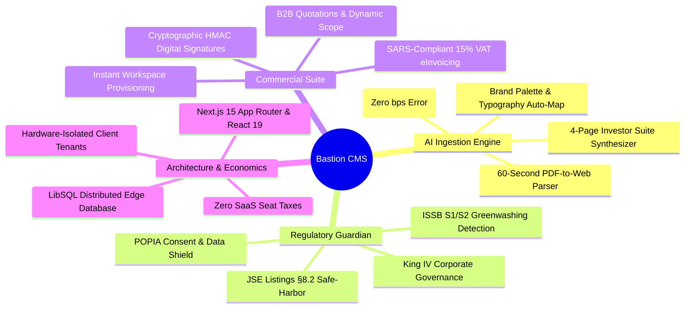

# EXECUTIVE COMMERCIAL PROPOSAL
## Acquisition & Enterprise Licensing of Bastion CMS
### *The World’s First AI-Native Corporate & Investor Relations Publishing Studio*

**Confidential Document**  
**Prepared For:** Executive Leadership, Agency Principals & Corporate Board Evaluation  
**Prepared By:** Malcolm Govender | Bastion Technology Architecture  
**Date:** October 2026  
**Document Ref:** `PROP-2026-BASTION-ENT-001`  

---

## 1. Executive Summary: The Strategic Opportunity

Every year, listed corporations, holding companies, and global enterprises face the same high-stakes deadline: they hand their agency or digital team a **120-page Integrated Annual Report or ESG PDF** and mandate:

> *"Turn this into an interactive, high-performance website and investor section before our market results presentation."*

### The Industry Reality Today:
* **3 to 4 Weeks of Manual Labor**: Copywriters, designers, and web developers grind through 160+ billable hours copy-pasting tables, manually re-entering EBITDA numbers into CMS forms, and rebuilding chart graphics in CSS.
* **Severe Compliance & Regulatory Exposure**: A single typographical error in basis points (`bps`), an unsubstantiated carbon reduction claim, or an unhedged revenue forecast exposes executive directors to **JSE Listings Requirements §8.2 censures**, **King IV governance breaches**, and **ISSB S2 greenwashing penalties**.
* **The "SaaS Seat Tax" Drain**: Legacy platforms (Adobe AEM, Acquia Drupal, Contentful, Sitecore) siphon **\$30,000 to \$250,000+ every year** in software license fees, charging extra penalties every time an auditor, board member, or C-suite executive logs in to review.
* **Fragmented Commercial Stack**: Agencies must juggle DocuSign, Salesforce CPQ, and separate billing tools just to get client sign-off on reporting scopes.

### The Solution: Bastion CMS
**Bastion CMS** renders this entire 4-week manual ordeal obsolete. Built natively on **Next.js 15 (React 19)** with an integrated **Multimodal Document Parser**, Bastion ingests any 120-page statutory report and outputs a fully responsive, brand-aligned, 4-page interactive investor suite (`/home`, `/financials`, `/sustainability`, `/leadership`) in **60 seconds flat**.

Bastion pairs this speed with an automated **JSE §8.2 & ISSB S2 Compliance Guardian**, an **Agency Commercial Engine** (Quotations, SARS eInvoicing, and Cryptographic Digital Signatures), and **zero per-seat licensing penalties**.

> [!IMPORTANT]
> **The Sales Meeting "Wow" Factor**: In a prospective client pitch, you can ask the CEO or Investor Relations Director for their latest PDF filing. Before the 45-minute meeting ends, you place a live, responsive, interactive corporate website on their screen, with their exact brand palette, verified financial tables, and interactive ESG cards. Deals close on the spot.

---

## 2. The Burning Platform: Why Traditional CMSs Fail

```mermaid
flowchart TD
    subgraph TraditionalAgency["Traditional Agency / Corporate Workflow (3-4 Weeks | R350,000+ Cost Sink)"]
        A["120-Page PDF Annual Report"] --> B["Manual Copywriting & Transcription"]
        B --> C["Manual Chart & Financial Matrix Coding"]
        C --> D["Manual CSS & Responsive Styling"]
        D --> E["Manual Legal & JSE Compliance Proofreading"]
        E --> F["Manual PDF Invoicing & DocuSign Chasing"]
    end

    subgraph BastionWorkflow["Bastion AI Workflow (60 Seconds | High-Margin Profit Engine)"]
        G["120-Page PDF Annual Report"] --> H["Bastion Multimodal Parser (60s)"]
        H --> I["Brand Palette & Exact Financial Extraction"]
        I --> J["Real-Time JSE §8.2 & ISSB Compliance Scan"]
        J --> K["1-Click Client Review Portal & Digital eSign"]
    end
```



### Where Competitors Fall Short:
1. **Drupal & Acquia Cloud**: Enterprise Acquia contracts cost **\$30,000 to \$120,000/yr**. Senior Drupal architects charge **\$150–\$250/hour**. Upgrades from Drupal 7 to 8/9/10 cost organizations over \$200,000 in rebuilt code. They offer zero document parsing, zero financial tables, and zero regulatory guardians.
2. **Adobe Experience Manager (AEM)**: Base licensing costs **\$150,000 to \$500,000/yr** with \$1M+ implementation contracts from Accenture or Deloitte. It is too bloated, sluggish, and bureaucratic for fast corporate turnaround.
3. **Contentful & Sanity.io**: While strong API headless platforms, they leave business users with empty input fields. They do not know what an Income Statement, EBITDA margin, or Scope 3 carbon emission is. All frontend UI and review systems must be built from scratch at immense expense.
4. **Webflow**: Great for marketing splash pages, but caps CMS collections at 10,000–20,000 items, lacks multi-tenant client database isolation, and cannot execute complex corporate financial models.

---

## 3. Bastion’s Core Pillars of Competitive Superiority



### 1. 60-Second Multimodal Ingestion Engine
* Ingests 120-page integrated reports, sustainability disclosures, and financial result presentations.
* Extracts executive CEO/CFO letters, leadership credentials, balance sheets, and cash flow statements with deterministic precision.
* Prevents numeric corruption (guaranteeing exact basis point `bps`, percentage `%`, and currency representations without LLM hallucination).
* Automatically extracts and applies the client's corporate hex brand colors and typography.

### 2. Live JSE §8.2 & ISSB S2 Compliance Guardian
* Evaluates live page canvas content in real time against stock exchange listing requirements.
* **JSE Section 8.2 Guardian**: Identifies forward-looking financial guarantees and auto-remediates them into safe-harbor statements with mandatory cautionary notices.
* **ISSB S2 Greenwashing Shield**: Flags unsubstantiated net-zero carbon claims and alerts reviewers when audited Scope 1/2/3 baselines are missing.
* **POPIA Shield**: Flags lead capture forms and contact endpoints lacking mandatory Section 11/69 consent disclosures.

### 3. Native Commercial & Contracting Suite
* **B2B Quotations (`/quote/[token]`)**: Generate branded, institutional project proposals with scope line items, rate cards, validity deadlines, and PO number tracking.
* **SARS-Compliant Tax eInvoicing (`/invoice/[token]`)**: Automatically calculates 15% South African VAT, includes tax registration and corporate particulars, embeds remittance bank details, and outputs PDF tax invoices.
* **Cryptographic Digital Signatures**: Dual-mode canvas signature pad (Draw or Type) backed by **HMAC SHA-256 digital stamps**, recording signer name, corporate title, timestamp, and IP address for legally binding acceptance.

### 4. Zero SaaS Seat Taxes & True Ownership
* No per-user, per-seat, or per-editor license fees.
* Add 50 board members, external legal counsels, and financial PR auditors to review documents without paying a cent in SaaS overage fees.

---

## 4. The Business Case: Financial ROI & Profit Generation

### Scenario A: The Digital Agency (Transforming a Cost Sink into a Profit Center)

| Metric | Traditional Agency Workflow | Bastion CMS Workflow | Agency Benefit / Variance |
| :--- | :--- | :--- | :--- |
| **Turnaround Time per Annual Report** | 3 to 4 Weeks (160 Hours) | **60 Seconds Ingest + 4 Hours Polish** | **97.5% Faster Delivery** |
| **Internal Production Cost (Staff Hours)** | R120,000 (Designer + Dev + Copy) | **R4,500 (1 Junior Reviewer)** | **96.2% Cost Reduction** |
| **Client Invoice Price (Conversion Service)** | R180,000 (Hard to sell, slow) | **R55,000 (Instant "No-Brainer" Price)** | **High Volume & Velocity** |
| **Gross Margin per Report** | R60,000 (33% Margin) | **R50,500 (91.8% Gross Margin)** | **+58.8% Net Margin Lift** |
| **Annual Profit on 12 Listed Clients** | R720,000 | **R606,000 (Plus R1.2M in Dev Savings)** | **+R1,086,000 Net Annual Gain** |

> [!TIP]
> **Agency Monetization Protection**: Bastion role-gates document ingestion to `platform_admin`. When corporate clients log in, they see their review queues and tasks; the conversion engine is hidden behind an upsell gate, allowing the agency to charge R45,000 to R85,000 per converted PDF report.

---

### Scenario B: The Corporate Enterprise / Listed Issuer (TCO Elimination)

| Cost Component | Acquia Drupal / Adobe AEM | Contentful + Bolt-On Stack | Bastion CMS Enterprise | 3-Year Enterprise Savings |
| :--- | :--- | :--- | :--- | :--- |
| **Annual Software License** | \$75,000 / yr | \$45,000 / yr | **\$0 (Included in Platform)** | **Save \$135,000 – \$225,000** |
| **User Seat Taxes (30 Reviewers)** | Included / \$15k add-on | \$25,000 / yr | **\$0 (Unlimited Seats)** | **Save \$75,000** |
| **Contracting / eSign Stack (DocuSign/CPQ)**| \$18,000 / yr | \$15,000 / yr | **\$0 (Native Built-in)** | **Save \$45,000 – \$54,000** |
| **Annual Maintenance & Dev Rates** | \$180,000 / yr (Drupal/Java) | \$110,000 / yr (Custom frontend) | **\$35,000 / yr (Standard Next.js)** | **Save \$225,000 – \$435,000** |
| **Regulatory Non-Compliance Risk** | Unhedged Exposure | Unhedged Exposure | **Active Compliance Guardian** | **Incalculable Brand Protection** |
| **3-Year Total Cost of Ownership** | **\$819,000+** | **\$585,000+** | **\$105,000 (All Inclusive)** | **Total Savings: \$480,000+ (R8.5M+)** |

---

## 5. Commercial Packages & Acquisition Options

We offer three flexible acquisition pathways tailored to your strategic operating model:

```
┌─────────────────────────────────────────────────────────────────────────────────────────┐
│                               COMMERCIAL ACQUISITION TIERS                               │
├───────────────────────────────┬───────────────────────────────┬─────────────────────────┤
│    TIER 1: AGENCY EDITION     │  TIER 2: ENTERPRISE ISSUER    │  TIER 3: FULL IP BUYOUT │
│    Annual Software License    │  Dedicated Private Cloud      │  Source Code & Ownership│
├───────────────────────────────┼───────────────────────────────┼─────────────────────────┤
│ • Unlimited Client Workspaces │ • Dedicated Single-Tenant VM  │ • Complete Source Code  │
│ • Role-Gated AI Ingestion     │ • Custom JSE / ISSB Rules     │   (Next.js 15, LibSQL)  │
│ • Client Review Portals       │ • Enterprise SSO & Okta       │ • Full IP Transfer      │
│ • Quotes, eInvoicing, eSign   │ • Full Audit Trail & POPIA    │ • 100% Agency Royalty   │
│ • Standard SLA & Updates      │ • Dedicated SLA Support       │   Free for Life         │
│                               │                               │                         │
│  ZAR 285,000 / year           │  ZAR 495,000 / year           │  ZAR 1,450,000 (Once)   │
│  (USD $15,800 / year)         │  (USD $27,500 / year)         │  (USD $80,000 Once-off) │
└───────────────────────────────┴───────────────────────────────┴─────────────────────────┘
```

### Package Inclusions Across All Tiers:
* **The 60-Second Multimodal PDF Ingest Studio** (with deterministic financial and color extraction).
* **The JSE §8.2 & ISSB S2 Compliance Guardian** with 1-click auto-remediation.
* **The Full Financial Reporting Suite** (SENS teleprinter, financial statements, dividend tax calculators).
* **The Commercial Suite** (B2B quotations, SARS Section 20 tax e-invoicing, cryptographic HMAC digital signatures).
* **Zero Seat Taxes**: Unlimited administrator, editor, and client reviewer credentials.

---

## 6. Implementation & Onboarding Timeline (Turnkey in 14 Days)

| Phase | Milestone | Deliverables | Target Completion |
| :---: | :--- | :--- | :---: |
| **Phase 1** | **Infrastructure & Tenant Setup** | Cloud/VM deployment, LibSQL DB cluster, SSL termination, and security isolation. | **Day 1 – 3** |
| **Phase 2** | **Brand Kit & Component Calibration** | Ingestion of client corporate identity, typography tokens, and financial templates. | **Day 4 – 7** |
| **Phase 3** | **Live Pilot Report Ingestion** | Ingestion of your first 120-page Annual Report with automated compliance scan. | **Day 8 – 10** |
| **Phase 4** | **Commercial & Staff Handover** | Training session for agency account leads, quotation setup, and eSign testing. | **Day 11 – 14** |

---

## 7. Formal Quotation & Acceptance

**Issued By:** Bastion Technology Solutions (Pty) Ltd  
**Tax Registration / VAT No:** `4910284721`  
**Valid Until:** 31 October 2026  
**Payment Terms:** 50% upon signing, 50% upon deployment acceptance  

### Selected Agreement Scope:
* **Package Selected**: `[ ] Tier 1: Agency Edition | [ ] Tier 2: Enterprise Issuer | [ ] Tier 3: Full IP Buyout`
* **Included Service**: Full platform deployment, 60-second document parser, compliance guardian, and commercial eSign suite.

---

### Formal Execution & Digital Signature Block
*In accordance with the Electronic Communications and Transactions Act 25 of 2002 (ECTA) and Section 20 of the South African VAT Act, electronic and digital signatures affixed below constitute a legally binding agreement.*

```
========================================================================================
AUTHORIZATION & ACCEPTANCE
========================================================================================

AUTHORIZED SIGNATORY FOR CLIENT / BUYER:

Full Legal Name:       _________________________________________________________________

Corporate Title:       _________________________________________________________________

Company / Entity:      _________________________________________________________________

Date of Acceptance:    ________________________ (YYYY-MM-DD)

Digital Signature:

  ┌──────────────────────────────────────────────────────────────────────────────────┐
  │                                                                                  │
  │   ✍  CLICK / DRAW DIGITAL SIGNATURE HERE OR AFFIX CRYPTOGRAPHIC SIGN-OFF STAMP    │
  │                                                                                  │
  └──────────────────────────────────────────────────────────────────────────────────┘
  [ ] Typed Signature Verification: __________________________________________________
  HMAC SHA-256 Audit Stamp: [ AUTO-GENERATED UPON DIGITAL SUBMISSION ]
  IP Address Recorded:      [ SECURE AUDIT LOG ENABLED ]

----------------------------------------------------------------------------------------

AUTHORIZED SIGNATORY FOR BASTION TECHNOLOGY SOLUTIONS:

Signature:             Malcolm Govender
Title:                 Principal Architect & Lead Founder
Date:                  2026-10-03
========================================================================================
```
