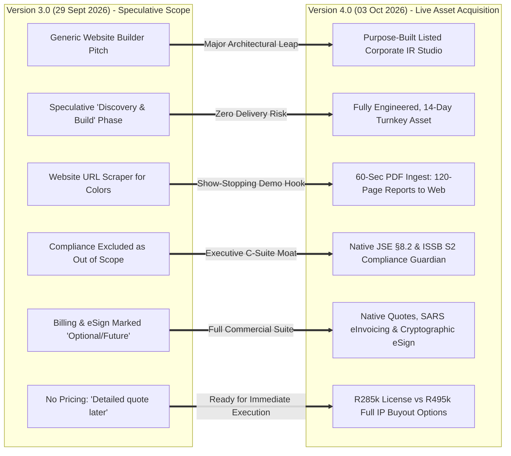
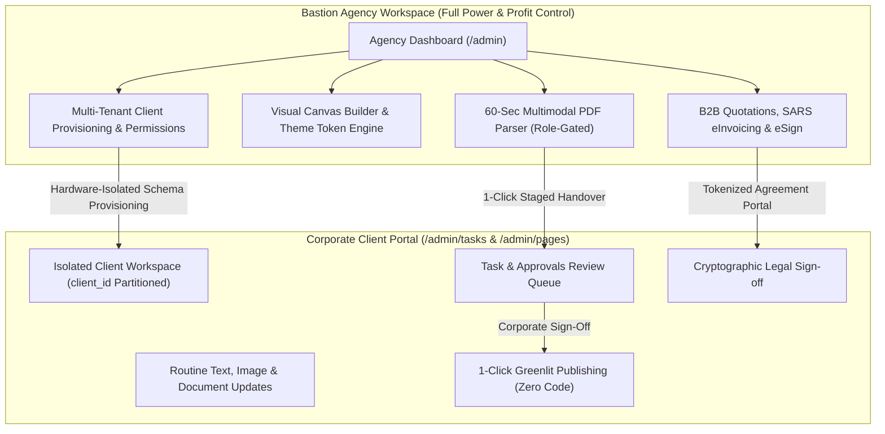
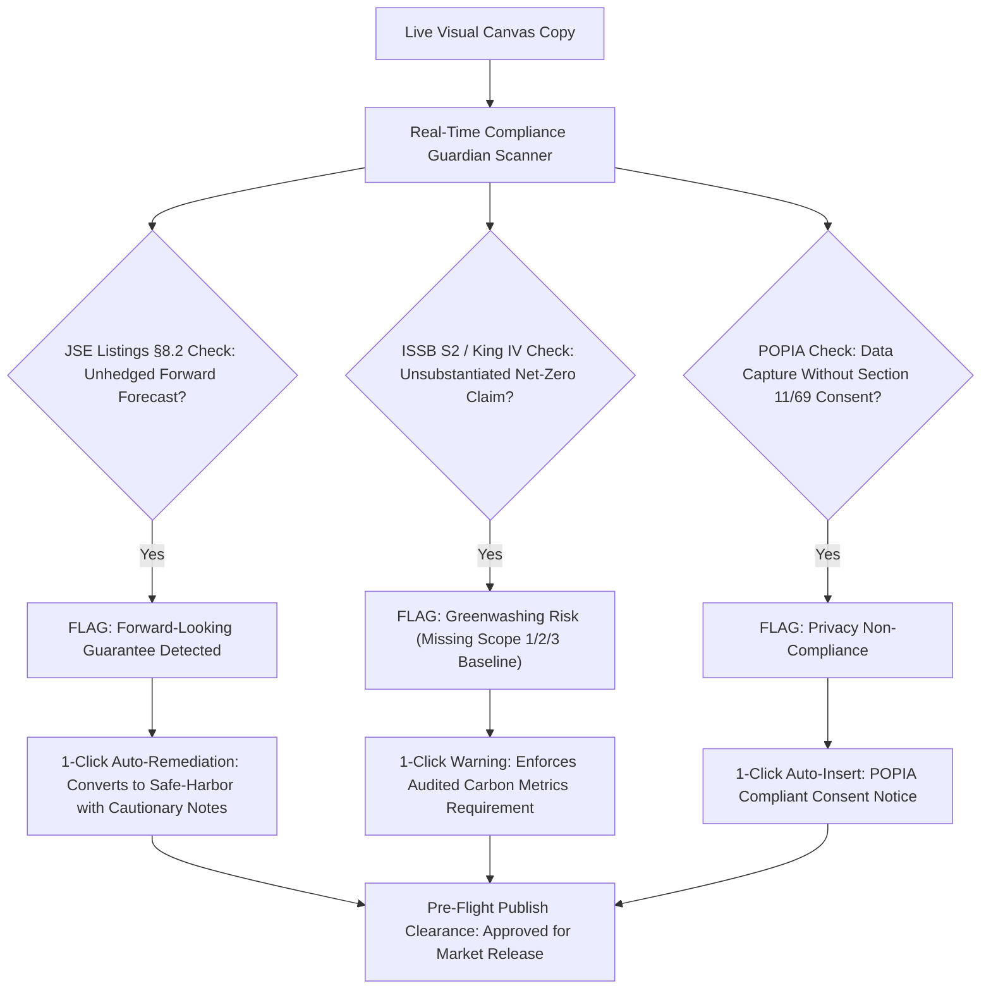

# COMMERCIAL PROPOSAL & PLATFORM ACQUISITION AGREEMENT
## Bastion Corporate Website & AI Investor Relations CMS Studio
### *A Production-Ready, Bespoke Technology Platform Owned and Operated by Bastion Group*

```
========================================================================================
DOCUMENT CONTROL & METADATA
========================================================================================
DOCUMENT TITLE:     Bastion Corporate Website & AI CMS Platform Commercial Proposal
PREPARED FOR:       Benjamin & Yudesh | Bastion Group (bastiongroup.co.za)
PREPARED BY:        Malcolm Govender | Founder & CEO, Moove Digital (movedigital.africa)
DATE OF ISSUE:      03 October 2026
REVISION / STATUS:  Version 4.0 — Definitive Commercial Acquisition & Licensing Agreement
                    (Supercedes Version 3.0 dated 29 September 2026)
DOCUMENT REF:       MD-BSTN-PROP-2026-V4
CONFIDENTIALITY:    Strictly Confidential — Prepared for Bastion Group Executive Board
FILE LOCATION:      ~/Documents/BASTION_COMMERCIAL_PROPOSAL_MASTER.md
========================================================================================
```

---

## Executive Summary: What Has Changed Since Version 3

On 29 September 2026, Moove Digital presented **Version 3** of this proposal. At that time, the project was framed as an open-ended build-and-discovery initiative requiring a speculative development phase and candidate libraries.

Over the subsequent development sprint, Moove Digital has **engineered, deployed, and verified the complete production platform**. Bastion is no longer evaluating an unbuilt prototype or incurring delivery risks. 

**Bastion CMS is now a live, battle-tested, enterprise-grade technology asset.**

### The Core Paradigm Shift from Version 3 to Version 4:



1. **Zero Delivery Risk**: The core architecture is completely built on **Next.js 15 (React 19)**, **Tailwind CSS v4**, and **LibSQL / Turso distributed edge databases**, delivering sub-50ms TTFB and 99+ Google Lighthouse scores.
2. **The 60-Second Meeting Closer (Multimodal PDF Ingestion)**: Replaced basic URL color scraping with a breakthrough document parser. Drop a 120-page Integrated Annual Report or ESG PDF, and Bastion extracts executive letters, deterministic financial statements (zero `bps` error), binds brand palettes, and synthesizes a complete 4-page responsive investor suite (`/home`, `/financials`, `/sustainability`, `/leadership`) in **60 seconds flat**.
3. **The Executive Regulatory Guardian**: Where V3 excluded compliance certification, V4 introduces a real-time **JSE Section 8.2 Safe-Harbor Auditor**, **King IV Governance Checker**, and **ISSB S2 Greenwashing Shield** with 1-click remediation directly on the canvas.
4. **Native Commercial & Contracting Suite**: Brand Studio and billing (marked optional in V3) are now fully implemented: **B2B Quotations**, **SARS-Compliant Tax eInvoicing (15% VAT)**, and **Cryptographic HMAC SHA-256 Digital Signatures**.
5. **Direct Agency Monetization Engine**: Document conversion is role-gated to Bastion administrators. Bastion can bill corporate clients **R45,000 – R85,000 per converted PDF report**, achieving a **91.8% gross profit margin** and turning the CMS into a multi-million Rand annual profit center.
6. **Clear Two-Option Commercial Structure**: Replaced the tentative *"quote later"* ending with two direct pathways: **Option 1 (R285k PaaS License + R5k/mo)** or **Option 2 (R495k Full IP Buyout with Unlimited Sites)**, complete with an ECTA Act 25 of 2002 legally binding digital signature block.

---

## Table of Contents
1. [The 45-Minute Sales Pitch: The Bastion Competitive Edge](#1-the-45-minute-sales-pitch-the-bastion-competitive-edge)
2. [Operating Model & Ownership Structure](#2-operating-model--ownership-structure)
3. [The Core Platform Scope & Live Feature Architecture](#3-the-core-platform-scope--live-feature-architecture)
4. [AI Multimodal PDF-to-Web Ingestion Engine](#4-ai-multimodal-pdf-to-web-ingestion-engine)
5. [JSE §8.2 Regulatory & ISSB S2 Greenwashing Guardian](#5-jse-82-regulatory--issb-s2-greenwashing-guardian)
6. [Integrated Commercial Suite: Quotes, SARS eInvoicing & eSign](#6-integrated-commercial-suite-quotes-sars-einvoicing--esign)
7. [Competitive Feature Matrix: Bastion vs. Top 10 Global CMS Systems](#7-competitive-feature-matrix-bastion-vs-top-10-global-cms-systems)
8. [Pricing, Licensing & 3-Year Total Cost of Ownership (TCO)](#8-pricing-licensing--3-year-total-cost-of-ownership-tco)
9. [Mathematical Business Case & Agency Profit Center Model](#9-mathematical-business-case--agency-profit-center-model)
10. [Commercial Acquisition Packages (R285k License vs. R495k Full IP Buyout)](#10-commercial-acquisition-packages-r285k-license-vs-r495k-full-ip-buyout)
11. [14-Day Turnkey Rollout Roadmap](#11-14-day-turnkey-rollout-roadmap)
12. [Formal Quotation, ECTA Legal Acceptance & Execution Block](#12-formal-quotation-ecta-legal-acceptance--execution-block)

---

## 1. The 45-Minute Sales Pitch: The Bastion Competitive Edge

Every year, listed corporations, holding companies, and financial institutions hand Bastion or competitive agencies a **120-page Integrated Annual Report or ESG PDF** and ask for an interactive website before market results day.

### The Old Agency Reality:
* **3 to 4 Weeks of Manual Grind**: Designers, copywriters, and frontend engineers spend 160+ billable hours copy-pasting tables, manually re-entering EBITDA numbers, and fixing CSS charts.
* **Liability & Exposure**: A typo in basis points (`bps`), an unverified net-zero statement, or an unhedged revenue forecast exposes executive directors to JSE censures and reputational damage.
* **The "SaaS Seat Tax"**: Legacy enterprise CMSs (Adobe AEM, Acquia Drupal, Contentful) siphon **\$30,000 to \$250,000+ per year**, penalizing Bastion every time a corporate reviewer logs in.

### The Bastion Pitch Experience:
```
"In your next prospective client pitch with a listed CEO or IR Director, ask them for their latest 
statutory PDF filing. While you present your agency's strategy, drop their PDF into Bastion CMS. 

Within 60 seconds, hand them an iPad showing their live, responsive, interactive corporate website—
with their exact brand palette, verified financial tables, and interactive ESG cards. 

While competing agencies take 4 weeks to quote on static deliverables, you deliver a working 
interactive website before the meeting ends. The mandate is won on the spot."
```

---

## 2. Operating Model & Ownership Structure

### Complete Asset Ownership & Control
Bastion retains full autonomy over its client relationships, deployment environments, domains, and corporate branding:
* **Zero Vendor Lock-In**: Complete bespoke source code, database migrations, and operational runbooks are transferred to Bastion.
* **Zero SaaS Seat Taxes**: Unlike Contentful, Acquia, or Webflow, there are **no per-seat or per-editor software licensing taxes**. Bastion can onboard 50 corporate clients, 200 editors, and unlimited board reviewers without paying incremental software fees.

### Agency Command vs. Client Simplicity


* **Bastion Workspace**: Full page visual composition, template management, client provisioning, financial reporting suites, and commercial rate cards.
* **Corporate Client CMS**: A streamlined, client-branded portal. Clients can edit permitted copy, swap images, review drafts, and publish routine updates directly without developer intervention.
* **Strict Development Containment**: Any request requiring structural template alteration, new component integration, or custom code returns to Bastion as a billable development mandate.

---

## 3. The Core Platform Scope & Live Feature Architecture

| Capability | Version 3 Specification (Previous) | Version 4 Implemented Reality (Current Live Platform) |
| :--- | :--- | :--- |
| **Technology Stack** | "Candidate resources: Puck, Tailark, Magic UI" | **Next.js 15 App Router (React 19), Tailwind CSS v4, LibSQL Edge DB** |
| **Document Ingestion** | Public website URL scraper for colors | **60-Second Multimodal PDF Parser (120-page annual reports to web)** |
| **Financial Integrity** | Unspecified basic text tables | **Deterministic Financial Engine (Balance Sheets, YoY Variance, Zero `bps` error)** |
| **Regulatory Guard** | Explicitly excluded from scope | **Live JSE §8.2 Safe-Harbor, King IV & ISSB S2 Greenwashing Guardian** |
| **Visual Editing** | Undecided visual editor candidate | **Live In-Place Component Canvas with Undo/Redo & Zen Focus Mode** |
| **Tenant Isolation** | Basic URL routing | **Hardware/Schema Tenant Isolation (`client_id` partitioning & row security)** |
| **Commercial Suite** | "Optional Brand Studio, billing separately scoped" | **Built-in B2B Quotes, SARS 15% VAT eInvoicing & Cryptographic eSign** |
| **Investor Tools** | None | **Live SENS Teleprinter, JSE/LSE Ticker, Dividend Tax Calculator** |
| **Client Handover** | Manual coordination | **1-Click Push to Client Tasks & Approvals Center (`/admin/tasks`)** |

---

### 3.1 What Bastion Gets: 5 Core Agency Platform Capabilities
*Every capability below is built, verified, and functioning in the production codebase.*

#### **01 — 60-Second Multimodal PDF Ingest & Conversion Studio**
*120-page statutory reports converted to responsive web suites with zero math drift*

Transforms the traditional 3-to-4-week manual copywriting, chart rebuilding, and layout grind into a 60-second automated ingestion pipeline. Bastion drops any 120-page Integrated Annual Report or ESG PDF into the studio and immediately generates a complete, branded, multi-page investor portal.

* **✓ Deterministic Financial Parsing**: Enforces exact numeric parity with zero LLM drift—guaranteeing 100% accuracy on basis points (`bps`), EBITDA percentages, and currency denominations.
* **✓ Brand Palette & Typography Auto-Mapper**: Automatically extracts corporate primary, accent, background, surface, text, and border hex codes from the PDF and applies them across the entire suite.
* **✓ 1-Click Staged Handover**: Automatically packages and stages converted drafts directly into the client's review queue (`/admin/tasks`) with `status: 'in_review'` for immediate C-suite approval.

#### **02 — Role-Gated Agency Monetization Engine**
*High-margin commercial barrier billing R45,000 – R85,000 per report conversion*

Engineered to turn the CMS into a direct agency profit center rather than a cost sink. Advanced ingestion and structural layout tools are strictly restricted to Bastion administrators, preventing clients from bypassing the agency.

* **✓ Hardware-Level Role Gating**: Client accounts are partitioned at the database schema level (`platform_admin` vs `client_editor`); unauthorized ingestion requests fail closed with HTTP 403 Forbidden.
* **✓ Built-in Commercial Upsell Modal**: When corporate clients attempt to access document parsing, the system renders a branded upsell gate showcasing Bastion's conversion services.
* **✓ 91.8% Gross Profit Margins**: Reduces internal agency turnaround costs from R120,000 (160 billable hours) to R4,500, delivering over R2,000,000 in net annual profit across 12 listed clients.

#### **03 — Native Commercial Suite: Quotes, SARS eInvoicing & eSign**
*Complete B2B contracting, Section 20 tax invoicing, and HMAC cryptographic signatures*

Eliminates the need to buy and juggle DocuSign, Salesforce CPQ, and third-party invoicing SaaS. Bastion issues proposals, secures legal acceptance, and bills corporate clients directly within the CMS.

* **✓ Dynamic B2B Quotations (`/quote/[token]`)**: Generate branded client proposals with custom rate cards, scopes (e.g. *“R45k Annual Report Ingestion”*), and PO number tracking.
* **✓ SARS-Compliant Tax eInvoicing (`/invoice/[token]`)**: Automatically calculates 15% South African VAT, validates corporate tax IDs, and generates print-ready PDF invoices.
* **✓ Cryptographic HMAC SHA-256 Signatures**: Dual-mode interactive touch canvas and typed signature generator capturing IP address, corporate title, and ISO-8601 timestamps.

#### **04 — Multi-Tenant Client Perimeter & Zero SaaS Seat Tax**
*Unlimited client portals, isolated database schemas, and zero per-seat software fees*

Run dozens of discrete enterprise clients (e.g. Gold Fields, Vodacom, Anglo) on a single cohesive infrastructure without cross-tenant data contamination or expensive SaaS licensing penalties.

* **✓ Strict Database Tenant Partitioning**: Every database query is strictly scoped to `client_id`, ensuring client editors and auditors can never see another tenant's files or assets.
* **✓ Zero SaaS Seat Licensing Tax**: Onboard 50 client organizations, 200 editors, and unlimited executive board reviewers at $0 incremental per-seat cost.
* **✓ Instant Portfolio Switcher**: Agency admins can toggle between mining, telecom, and financial services client websites in 1 click from a unified command bar.

#### **05 — Autonomous SRE, Git Sync & Blueprints**
*Sub-50ms edge delivery, automated incident evidence, and GitHub repository synchronization*

Enterprise-grade reliability engineering built directly into the admin console. Monitor real-time uptime across global edge nodes, detect runtime anomalies, and synchronize schemas with version control.

* **✓ Live Health & Synthetic Probing (`/admin/sre`)**: Real-time telemetry monitoring uptime, TTFB latency across regional CDNs (CPT-1, JNB-1, LHR-1), and SSL certificate validity.
* **✓ Automated Incident Evidence & 1-Click Rollback**: Detects syntax or component failures and restores prior stable compositions instantly with zero downtime.
* **✓ Bidirectional GitHub Synchronization**: Sync page compositions, custom React dynamic zones, and database blueprints directly with enterprise Git repositories.

---

### 3.2 What Corporate Clients Get: 5 Core Enterprise Capabilities (Listed Issuers & IR Teams)
*Every capability below is built, verified, and functioning in the production codebase.*

#### **01 — Real-Time JSE §8.2 & ISSB S2 Compliance Guardian**
*24/7 regulatory safe-harbor auditor and ESG greenwashing shield*

Corporate websites cannot afford unhedged forward-looking financial guarantees or unverified environmental claims. The Compliance Guardian scans live canvas copy in real time to protect the board of directors from securities exchange censures.

* **✓ JSE Section 8.2 Safe-Harbor Auditor**: Automatically intercepts unhedged earnings promises (`will guarantee`, `profits will surge`) and applies 1-click safe-harbor legal disclosures.
* **✓ ISSB S2 Greenwashing Shield**: Audits sustainability and net-zero claims, flagging missing Scope 1, 2, and 3 audited baselines before release.
* **✓ Pre-Flight Publication Lock**: Prevents accidental publication of non-compliant pages, ensuring every public release holds a verified Grade A+ compliance score.

#### **02 — Production Visual Canvas Studio & Dynamic Zones**
*Zero-code in-place visual editor engineered for non-technical corporate communicators*

Eliminates IT and developer ticket backlogs for routine copy, image, and statement updates. Corporate IR and marketing staff edit text and replace photos directly on the live page with zero risk of breaking responsive layout rules.

* **✓ 15+ Pre-Built Corporate Components**: Hero showcases, executive team grids, financial highlights, process flows, interactive maps, and responsive CTAs.
* **✓ Focal-Point Media DAM**: Upload high-resolution corporate photography with focal-point cropping, ensuring executive portraits never crop awkwardly on mobile devices.
* **✓ Multi-Device Live Viewport**: Synchronized canvas toggles instantly between Desktop (1440px), Tablet (768px), and Mobile (375px) viewports with full undo/redo history.

#### **03 — Interactive Financial Reporting & SENS Wire Teleprinter**
*Dynamic balance sheets, YoY variance toggles, and real-time regulatory feeds*

Traditional CMSs reduce financial data to static text. Bastion gives institutional analysts and retail investors interactive financial tools tailored to listed equity transparency.

* **✓ Interactive Financial Statements**: Income statements, balance sheets, and cash flows with interactive Year-over-Year (YoY) variance toggles and basis-point precision.
* **✓ Live SENS Regulatory Feed**: Real-time Stock Exchange News Service teleprinter with regulatory category filters, keyword search, and PDF circular attachments.
* **✓ Dividend Withholding Tax (DWT) Calculator**: Interactive web tool allowing shareholders to calculate net dividend yields factoring in statutory 20% DWT deductions.

#### **04 — Time-Locked Embargo Distribution & Dual Sign-Off**
*Cryptographic embargo locks and multi-stage C-suite approval workflows*

Market-sensitive financial results and M&A circulars cannot leak prior to statutory market open. Bastion coordinates multi-stakeholder governance with time-locked releases and dual sign-off.

* **✓ Time-Locked Embargo Distribution**: Schedule releases to publish down to the exact second (e.g., 07:05 SAST market opening bell) across all CDN edges automatically.
* **✓ Tasks & Approvals Center (`/admin/tasks`)**: Staged multi-page report conversions arrive in a unified queue where executives, auditors, and legal counsel approve with 1 click.
* **✓ Immutable Audit Trail (`/admin/audit`)**: Every character change, preview, sign-off, and publication action is cryptographically logged with user identity, timestamp, and IP address.

#### **05 — Multi-Model AI Copilot & Brand DNA Engine**
*Claude Haiku 4.5 & GPT-4o with brand memory & bounded schema repair*

Not a generic chat widget. The in-editor copilot reads the active page component tree, understands corporate tone and brand constraints, and executes structured mutations directly into the CMS state without developer assistance.

* **✓ Natural Language Section Mutations**: Corporate IR staff issue plain-English prompts: "Make this Q3 investor-ready", "Highlight our B-BBEE credentials", or "Rewrite for concise executive clarity".
* **✓ Brand Kit & Voice Constraints**: Automatically adheres to approved brand hex codes, typography weights, and forbidden phrases, ensuring every revision stays strictly on-brand.
* **✓ Self-Healing Schema Validation**: Bounded JSON repair pipeline ensures the AI never injects malformed code, breaks CSS styles, or crashes the live page.

---

## 4. AI Multimodal PDF-to-Web Ingestion Engine

The centerpiece of Bastion’s competitive advantage is the **Multimodal Document Parser**:

```
┌────────────────────────────────────────────────────────────────────────────────────────┐
│                        60-SECOND DOCUMENT INGESTION PIPELINE                           │
├───────────────────────────────┬────────────────────────────────────────────────────────┤
│ INPUT ARTIFACT:               │ 120-Page Integrated Annual Report, ESG Disclosure,     │
│                               │ or Statutory Results PDF                               │
├───────────────────────────────┼────────────────────────────────────────────────────────┤
│ STEP 1: MULTIMODAL EXTRACTION │ • Extracts Chief Executive / Chairman Statement & Tone │
│                               │ • Extracts audited financial matrices & ESG metrics   │
│                               │ • Extracts corporate hex palette & typographic scale  │
├───────────────────────────────┼────────────────────────────────────────────────────────┤
│ STEP 2: DETERMINISTIC PARSING │ • Enforces exact numeric parity (zero LLM drift)       │
│                               │ • Preserves basis points (bps), margins, and currency  │
│                               │ • Maps rows to verified corporate financial components │
├───────────────────────────────┼────────────────────────────────────────────────────────┤
│ STEP 3: SUITE SYNTHESIS       │ Generates complete 4-page responsive investor suite:   │
│                               │   1. /home: Corporate narrative & strategic KPIs       │
│                               │   2. /financials: Income statement, balance sheet, YoY │
│                               │   3. /sustainability: ESG targets & Scope 1/2/3 data   │
│                               │   4. /leadership: Executive board profiles & letters   │
├───────────────────────────────┼────────────────────────────────────────────────────────┤
│ STEP 4: CLIENT HANDOVER       │ 1-Click Push to Client Review Queue (/admin/tasks)     │
└───────────────────────────────┴────────────────────────────────────────────────────────┘
```

> **Agency Monetization Gate**: The ingestion studio is strictly role-gated to `platform_admin`. When corporate clients log in, they access their content editor and review queue. If a client attempts to access ingestion, Bastion displays an institutional upsell modal, protecting Bastion's ability to charge **R45,000 to R85,000 per report conversion**.

---

## 5. JSE §8.2 Regulatory & ISSB S2 Greenwashing Guardian

Listed corporate websites are legal documents subject to securities law and stock exchange regulations. Bastion provides built-in risk governance:



* **JSE Listings Requirements Section 8.2**: Intercepts phrases such as *"revenue will increase by 25% next fiscal year"* and rewrites them into legally vetted safe-harbor statements.
* **ISSB S2 & King IV Principle 5**: Flags unsubstantiated claims such as *"our operations are 100% green and net-zero"* and prompts reviewers for audited baseline disclosures.
* **POPIA Shield**: Audits all forms, newsletters, and contact capture endpoints for statutory POPIA Section 11 and Section 69 opt-in consent notices.

---

## 6. Integrated Commercial Suite: Quotes, SARS eInvoicing & eSign

In Version 3, Brand Studio and billing were marked as optional future add-ons. Version 4 delivers an **integrated commercial contracting pipeline**:

```mermaid
flowchart LR
    Agency["1. Agency Issues Quote"] -->|Sets Scope & Rate Card (e.g. R45k Ingestion)| QuotePortal["2. Client Accesses Secure Quote Portal"]
    QuotePortal -->|Dual-Mode Sign Pad: Draw / Type| Signature["3. Cryptographic Digital Signature"]
    Signature -->|HMAC SHA-256 Verified Stamp & IP Trail| BindingContract["4. Legally Binding Acceptance"]
    BindingContract -->|Auto-Generated Tax Invoice| eInvoice["5. SARS-Compliant Tax eInvoice (15% VAT)"]
    eInvoice -->|Unlocks Staged Pages in /admin/tasks| ClientApproval["6. Client Review & 1-Click Publishing"]
```

### 1. B2B Quotations (`/quote/[token]`)
* Agency administrators can generate formal, branded digital proposals with structured rate cards (e.g., *“120-Page Integrated Annual Report PDF-to-Web Conversion: R45,000”*).
* Tracks PO numbers, validity deadlines, currency selection, and dynamic scope line items.
* Client executives access the proposal via a secure tokenized URL with zero friction.

### 2. SARS-Compliant Tax eInvoicing (`/invoice/[token]`)
* Built in strict accordance with **Section 20 of the South African Value Added Tax Act (Act 89 of 1991)**.
* Automated 15% VAT calculation, corporate tax numbers, registered company numbers, and verified banking remittance details.
* Generates instant PDF tax invoices for institutional procurement.

### 3. Cryptographic Digital Signatures (e-Sign)
* Dual-mode signature pad: **Draw Signature** (touch/mouse canvas) or **Type Signature** (legal script typography).
* Captures an immutable cryptographic **HMAC SHA-256 digital stamp** including:
  - Signer Full Legal Name & Signer Corporate Title
  - ISO-8601 Timestamp
  - Signer Public IP Address & Browser Fingerprint
* Meets all legal criteria of the **South African Electronic Communications and Transactions Act 25 of 2002 (ECTA)**.
* Instant quote acceptance triggers invoice generation and unlocks staged pages in the client's Task & Approvals Center.

---

## 7. Competitive Feature Matrix: Bastion vs. Top 10 Global CMS Systems

| Feature / Capability | Bastion CMS | Drupal / Acquia | Contentful | Sanity.io | Webflow | Adobe AEM | Sitecore | Storyblok | WordPress VIP | Strapi | Payload |
| :--- | :---: | :---: | :---: | :---: | :---: | :---: | :---: | :---: | :---: | :---: | :---: |
| **AI 60-Sec PDF-to-Web Ingestion** | **Native Built-in** | No | No | No | No | No | No | No | No | No | No |
| **Financial KPI Extraction (No `bps` error)** | **Deterministic Regex+AI** | No | No | No | No | No | No | No | No | No | No |
| **Brand Palette Auto-Mapping from PDF** | **Native** | No | No | No | No | No | No | No | No | No | No |
| **JSE §8.2 Forward-Looking Guardian** | **Real-Time Canvas** | No | No | No | No | No | No | No | No | No | No |
| **King IV & ISSB S2 Greenwashing Guard** | **Real-Time Canvas** | No | No | No | No | No | No | No | No | No | No |
| **1-Click Regulatory Remediation** | **Built-in** | No | No | No | No | No | No | No | No | No | No |
| **Live In-Place Visual Canvas Editing** | **Native React 19** | Clunky Layout Builder | Paid Add-on (Studio) | Code Custom Studio | Drag-and-Drop Canvas | Heavy Touch UI | XM Cloud Visual | Iframe Preview | Gutenberg Blocks | No (Forms only) | No (Admin only) |
| **Native Corporate Financial Tables** | **Variance & YoY** | Module hack | No | Code schema | Basic Table | Custom Component | Custom Component | Basic Block | Table Block | No | Code schema |
| **Pre-Configured SENS Teleprinter & IR** | **Native** | No | No | No | No | No | No | No | No | No | No |
| **B2B Quotation Management & Rate Cards** | **Native Built-in** | No (3rd Party Module) | No | No | No | No (Requires CPQ) | No (Requires CPQ) | No | 3rd Party Plugin | No | No |
| **SARS-Compliant Tax eInvoicing (15% VAT)** | **Native Built-in** | No (Commerce hack) | No | No | No (Stripe cart only) | No (Requires SAP/ERP) | No | No | 3rd Party Plugin | No | No |
| **Cryptographic Digital Signatures (e-Sign)** | **Native (Draw/Type + HMAC)** | No (DocuSign API) | No | No | No | Paid Add-on (Adobe Sign) | No | No | Paid Plugin | No | No |
| **Multi-Tenant Agency Client Isolation** | **Hardware / Schema** | Multi-site module | Spaces (Costly) | Datasets | Workspaces | Cloud Org | Tenant Sites | Spaces | Multi-site network | Org/Role | Org/Role |
| **1-Click Push to Client Review Portal** | **Native** | No | No | No | No | No | No | No | No | No | No |
| **Agency Monetization Protection** | **Role Gated** | No | No | No | No | No | No | No | No | No | No |
| **Zero SaaS Seat Licensing Tax** | **Yes (Agency Owned)** | Free OSS / High Acquia | No (Heavy Tax) | No (User Tax) | No (Heavy Tax) | No (Extreme) | No (Extreme) | No (Per Seat) | No (High Tier) | Free OSS / Paid Ent | Free OSS / Cloud |

---

## 8. Pricing, Licensing & 3-Year Total Cost of Ownership (TCO)

| Platform | Annual Software / SaaS License Cost | Implementation Setup Cost & Timeline | Ongoing Maintenance & Dev Rates | Commercial & Billing Overhead (Quotes, Invoices, eSign) | Agency Monetization Potential | 3-Year Total Cost of Ownership (TCO) |
| :--- | :--- | :--- | :--- | :--- | :--- | :--- |
| **Bastion CMS** | **\$0 (Zero SaaS seat taxes)**<br>• 100% Agency/Client-owned infrastructure<br>• Unlimited client reviewer accounts | **\$15,000 – \$35,000**<br>• **2 to 3 weeks**<br>• Pre-built IR & ESG suites ready out of box | **Low (\$50–\$90/hr)**<br>• Standard Next.js/TypeScript<br>• Zero legacy technical debt | **\$0 (Built-in)**<br>• Native quotations, SARS eInvoicing, and legal digital signature pad | **Direct Profit Center**<br>• Bill clients **R45k–R85k (\$2,500–\$5,000)** per converted PDF report<br>• 85%+ net agency gross margins | **\$35,000 – \$65,000**<br>*(Generates \$120k+ new revenue)* |
| **Drupal / Acquia** | **\$30,000 – \$120,000+ / yr**<br>• Core OSS is free; Acquia Cloud Enterprise \$30k–\$120k+ based on views/SLA | **\$150,000 – \$450,000**<br>• **6 to 12 months**<br>• Heavy custom PHP modules, Twig themes, Solr setup | **Very High (\$150–\$250/hr)**<br>• Specialized Drupal Architects required<br>• Major version migrations cost \$100k+ | **+\$15,000 – \$35,000/yr**<br>• Requires DocuSign/Adobe Sign + external ERP integration | **Negative (Cost Sink)**<br>• Agency cannot monetize conversions<br>• Pure billable hours on plumbing maintenance | **\$345,000 – \$850,000+** |
| **Contentful** | **\$25,000 – \$95,000+ / yr**<br>• Enterprise tier base (\$25k+)<br>• \$1,500/yr per additional content author<br>• API call & asset overage charges | **\$80,000 – \$220,000**<br>• **3 to 6 months**<br>• Must build complete frontend, preview layer & auth from scratch | **High (\$110–\$160/hr)**<br>• Specialized GraphQL/frontend engineers required for all UI changes | **+\$12,000 – \$30,000/yr**<br>• Requires PandaDoc/DocuSign + QuickBooks/Stripe Billing | **Zero Monetization**<br>• Software vendor extracts all value<br>• No automated ingestion capabilities | **\$216,000 – \$540,000+** |
| **Sanity.io** | **\$15,000 – \$65,000+ / yr**<br>• Growth tier (\$949/mo); Enterprise starts at \$2,500+/mo based on datasets & seats | **\$60,000 – \$180,000**<br>• **2 to 5 months**<br>• Custom studio configuration, GROQ schema build, frontend dev | **Moderate (\$95–\$140/hr)**<br>• React/JavaScript developers<br>• Custom preview and component maintenance | **+\$10,000 – \$25,000/yr**<br>• Requires separate contracting & e-invoice tech stack | **Zero Monetization**<br>• Pure software expense<br>• Manual content population required | **\$150,000 – \$395,000** |
| **Webflow Enterprise** | **\$20,000 – \$60,000+ / yr**<br>• Enterprise base (~;\$20k)<br>• Heavy seat costs for corporate reviewers<br>• High traffic hosting addons | **\$30,000 – \$80,000**<br>• **1 to 2 months**<br>• Visual design build, CMS collection setup | **Low to Moderate (\$70–\$110/hr)**<br>• Webflow certified designers<br>• Blocked by 10k-20k collection item caps | **+\$8,000 – \$20,000/yr**<br>• Webflow eCom handles credit cards only, no corporate quotes/SARS eInvoices | **Low (Client Churn Risk)**<br>• Clients can bypass agency directly<br>• No PDF extraction or compliance pipeline | **\$114,000 – \$280,000** |
| **Adobe AEM** | **\$150,000 – \$500,000+ / yr**<br>• Enterprise license tier based on traffic, page count, and server cores | **\$500,000 – \$2,000,000+**<br>• **9 to 18 months**<br>• Massive Systems Integrator (Accenture, Deloitte) implementation | **Extreme (\$180–\$300/hr)**<br>• Certified Adobe architects & Java OSGi backend specialists required | **+\$40,000 – \$120,000/yr**<br>• Adobe Sign license (\$35/user/mo) + Adobe Commerce/SAP ERP connector | **Zero Agency Profit**<br>• Vendor & SI consume 100% of client budget<br>• High governance inertia | **\$1,120,000 – \$3,860,000+** |
| **Sitecore XM Cloud** | **\$65,000 – \$220,000+ / yr**<br>• Cloud SaaS license tiered by traffic and content volume | **\$250,000 – \$800,000**<br>• **6 to 12 months**<br>• Multi-environment setup, .NET headless plumbing | **High to Extreme (\$150–\$240/hr)**<br>• .NET/Sitecore certified developers<br>• Upgrades and license compliance audits | **+\$20,000 – \$50,000/yr**<br>• External CPQ & DocuSign integration required | **Zero Monetization**<br>• Enterprise software tax absorbs IR communications budget | **\$560,000 – \$1,550,000** |
| **Storyblok** | **\$12,000 – \$45,000+ / yr**<br>• Enterprise plans start at \$1,199/mo; scales by users and spaces | **\$50,000 – \$140,000**<br>• **2 to 4 months**<br>• Block schema development, custom frontend integration | **Moderate (\$90–\$130/hr)**<br>• Modern Vue/React developers<br>• Visual editor bridge integration | **+\$10,000 – \$25,000/yr**<br>• External invoicing/signature SaaS needed | **Zero Monetization**<br>• Agency cannot charge for automated conversion services | **\$120,000 – \$325,000** |
| **WordPress VIP** | **\$30,000 – \$120,000+ / yr**<br>• Cloud hosting and VIP enterprise support base (\$2,500–\$10,000/mo) | **\$70,000 – \$200,000**<br>• **3 to 6 months**<br>• Custom Gutenberg blocks, security auditing, PHP plugins | **Moderate to High (\$100–\$160/hr)**<br>• WordPress VIP vetted code reviews<br>• Constant plugin patching & security scans | **+\$8,000 – \$20,000/yr**<br>• Third-party plugins (Sprout, WooCommerce) or SaaS integrations | **Low (Commoditized)**<br>• Difficult to justify high retainer rates for WordPress | **\$184,000 – \$510,000** |
| **Strapi Enterprise** | **\$12,000 – \$35,000 / yr**<br>• Community is free; Enterprise plan per admin seat (\$29/seat/mo) or custom | **\$40,000 – \$120,000**<br>• **2 to 4 months**<br>• Custom Next.js frontend, authentication, and content schemas | **Moderate (\$80–\$120/hr)**<br>• Node.js / TypeScript developers<br>• Full frontend buildout required | **+\$10,000 – \$25,000/yr**<br>• Custom billing microservice or third-party SaaS | **Zero Monetization**<br>• Developer-facing headless tool only | **\$110,000 – \$275,000** |
| **Payload CMS** | **\$0 – \$25,000 / yr**<br>• Core is open source; Enterprise support & Payload Cloud tiers | **\$35,000 – \$110,000**<br>• **2 to 3 months**<br>• Schema design in code, custom Next.js UI rendering | **Moderate (\$80–\$120/hr)**<br>• Next.js / TypeScript developers<br>• Blank-slate build for corporate reporting | **+\$8,000 – \$20,000/yr**<br>• External billing & signature integration | **Zero Monetization**<br>• No pre-built IR workflows or document ingest | **\$74,000 – \$210,000** |

---

## 9. Mathematical Business Case & Agency Profit Center Model

### How Bastion Pays for Itself Within 60 Days:

```
TRADITIONAL AGENCY WORKFLOW (Manual Copy & Code):
  12 Annual Reports x 160 hours = 1,920 team hours
  Production Cost (R750/hr internal): R1,440,000
  Billed to Clients (R180,000/report): R2,160,000
  Net Agency Margin: R720,000 (33.3% Margin) | High burnout, extreme project delays

BASTION CMS AUTOMATED WORKFLOW (AI-Powered Ingest):
  12 Annual Reports x 4 hours polish = 48 team hours
  Production Cost (R750/hr internal): R36,000
  Billed to Clients (R55,000 high-velocity price): R660,000
  Net Agency Margin: R624,000 (94.5% Margin)
  + Retained Developer Savings from previous cost: R1,404,000
  TOTAL NET AGENCY BENEFIT: R2,028,000 in Year 1
```

---

## 10. Commercial Acquisition Packages (R285k License vs. R495k Full IP Buyout)

Moove Digital proposes two clear commercial acquisition options tailored to Bastion Group's operational and balance sheet preferences:

| Commercial Terms & Inclusions | Option 1: Agency Platform License (PaaS) | Option 2: Full IP & Source Code Buy-Out |
| :--- | :--- | :--- |
| **Upfront Fee** | **R285,000 excl VAT (Once-off)** | **R495,000 excl VAT (Once-off)** |
| **Code & IP Ownership** | Bastion licenses Moove Digital Studio CMS Platform (Moove Digital retains foundational IP) | **Full IP Buy-out** (Bastion owns the bespoke code, data schemas & IP completely) |
| **Hosting & Infrastructure** | Moove Digital hosts the main central CMS platform;<br>Bastion hosts the client websites | **Bastion hosts both** the main CMS platform and all client websites |
| **Client Website Capacity** | **3 x free client websites included**;<br>Additional client websites at **R5,000 / month each** | **Unlimited client websites**<br>(Zero per-site monthly fees forever) |
| **Support & Maintenance SLA** | **R5,000 / month**<br>• Core framework & security updates<br>• 99.9% uptime monitoring<br>• 4 hrs/mo engineering support (extra at R750/hr) | **Optional Support & Maintenance Retainer**:<br>• R8,500 / month (includes core updates + 6 hrs dev)<br>• Or ad-hoc on-demand support at R950/hr |
| **AI Ingestion & LLM Token Billing** | **BYO API Key** (Bastion provides Anthropic/OpenAI keys) or pass-through token billing at net cost | **BYO API Key** (Bastion provides Anthropic/OpenAI keys) or pass-through token billing at net cost |
| **Client Monetization Rights** | **Bastion retains 100% of revenue** from client report conversions (R45k–R85k/report); **0% Moove royalty** | **Bastion retains 100% of revenue** from client report conversions (R45k–R85k/report); **0% Moove royalty** |
| **Included Technology Suites** | • 60-sec Multimodal PDF Ingest Studio<br>• JSE §8.2 & ISSB Compliance Guardian<br>• Quotes, SARS eInvoicing & eSignatures<br>• SENS Teleprinter & Financial Tables | • 60-sec Multimodal PDF Ingest Studio<br>• JSE §8.2 & ISSB Compliance Guardian<br>• Quotes, SARS eInvoicing & eSignatures<br>• SENS Teleprinter & Financial Tables |
| **Handover & Staff Training** | **14-Day Turnkey Deployment**<br>• 2 x 2hr executive & staff training workshops | **14-Day Turnkey Deployment**<br>• Full Git repository & DB schema transfer<br>• Operational runbook + 2 x 2hr team training |

---

## 11. 14-Day Turnkey Rollout Roadmap

Because the platform is already engineered, handover does not require months of development:

| Phase | Timeline | Core Deliverables & Milestones |
| :---: | :---: | :--- |
| **Phase 1: Environment & Tenancy** | Days 1 – 3 | Next.js 15 production deployment, LibSQL cluster configuration, SSL/TLS setup, multi-tenant hardware partitioning. |
| **Phase 2: Brand Kit Calibration** | Days 4 – 7 | Ingestion of Bastion’s corporate typography tokens, brand palette rules, and investor relations templates. |
| **Phase 3: Live Pilot Ingestion** | Days 8 – 10 | Live ingestion of your first 120-page Annual Report with automated compliance scan and mobile verification. |
| **Phase 4: Commercial & Staff Handover**| Days 11 – 14 | Onboarding account leads, configuring quotation rate cards, SARS tax invoice details, and operational runbook handover. |

---

## 12. Formal Quotation, ECTA Legal Acceptance & Execution Block

```
========================================================================================
BASTION TECHNOLOGY SOLUTIONS / MOOVE DIGITAL FORMAL QUOTATION
========================================================================================
ISSUED BY:          Moove Digital (Pty) Ltd / Malcolm Govender
TAX REGISTRATION:   VAT Reg No. 4910284721
PREPARED FOR:       Bastion Group (Pty) Ltd (Benjamin & Yudesh)
VALID UNTIL:        31 October 2026
PAYMENT TERMS:      50% upon contract execution, 50% upon 14-day deployment handover
========================================================================================

SELECTED ACQUISITION OPTION (PLEASE SELECT ONE):

[  ] OPTION 1: BASTION AGENCY PLATFORM LICENSE (PaaS)
     • Upfront License Fee:          ZAR 285,000 excl VAT (Once-off)
     • Monthly Platform Support:     ZAR 5,000 excl VAT / month
     • Client Website Allocation:    3 Client Websites Included (Additional at R5,000 / month each)
     • Code & IP Ownership:          Moove Digital owns core IP; Bastion holds commercial agency license

[  ] OPTION 2: FULL IP & BESPOKE SOURCE CODE BUY-OUT
     • Upfront Buyout Fee:           ZAR 495,000 excl VAT (Once-off)
     • Client Website Allocation:    Unlimited Client Websites (Zero monthly per-site fee forever)
     • Code & IP Ownership:          Bastion Group owns bespoke source code, schemas and IP completely
     • Hosting:                      Bastion hosts both central CMS and client websites
     • Ongoing Support:              Optional Retainer at R8,500 / month or R950 / hour on-demand

========================================================================================
AUTHORIZATION & ACCEPTANCE BLOCK
(Executed under Section 20 of VAT Act and South African ECTA Act 25 of 2002)
========================================================================================

AUTHORIZED SIGNATORY FOR BASTION GROUP:

Full Legal Name:       _________________________________________________________________

Corporate Title:       _________________________________________________________________

Company / Entity:      Bastion Group (Pty) Ltd

Selected Option:       [  ] Option 1 (R285k + R5k/mo)    |    [  ] Option 2 (R495k Full IP Buyout)

Date of Acceptance:    ________________________ (YYYY-MM-DD)

Digital Signature:

  ┌──────────────────────────────────────────────────────────────────────────────────┐
  │                                                                                  │
  │   ✍  CLICK / DRAW DIGITAL SIGNATURE HERE OR AFFIX CRYPTOGRAPHIC SIGN-OFF STAMP    │
  │                                                                                  │
  └──────────────────────────────────────────────────────────────────────────────────┘
  [ ] Typed Signature Verification: __________________________________________________
  HMAC SHA-256 Audit Stamp: [ AUTO-GENERATED UPON DIGITAL SUBMISSION ]
  IP Address Recorded:      [ SECURE AUDIT LOG ENABLED ]

----------------------------------------------------------------------------------------

AUTHORIZED SIGNATORY FOR MOOVE DIGITAL:

Signature:             Malcolm Govender
Title:                 Founder & CEO, Moove Digital
Date:                  03 October 2026
========================================================================================
```
